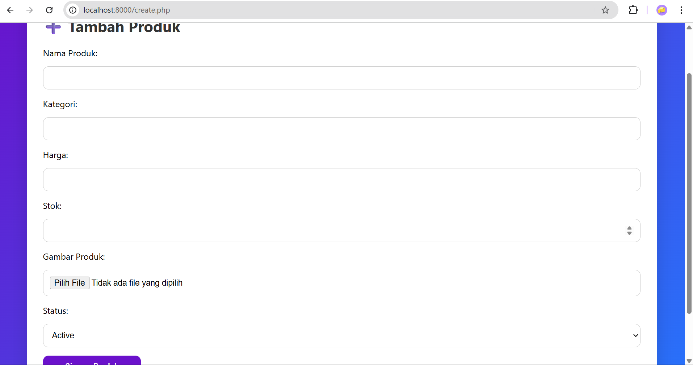
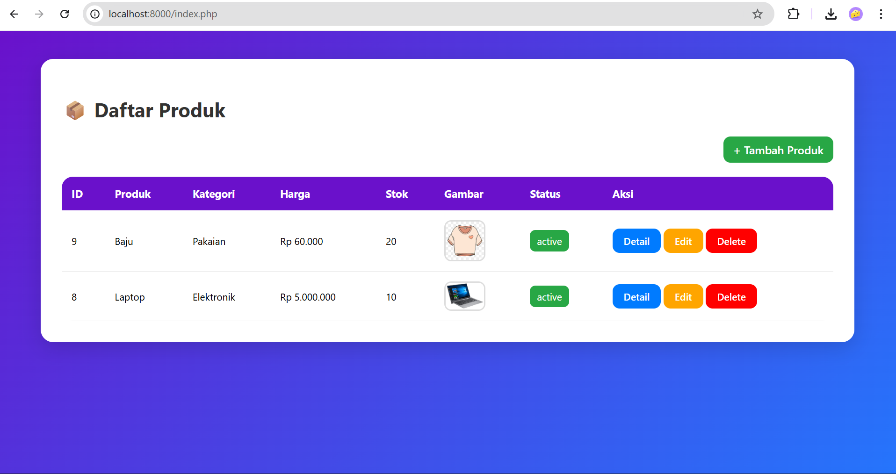
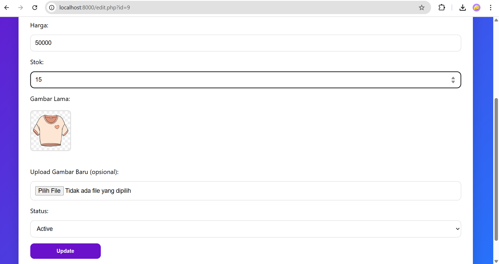
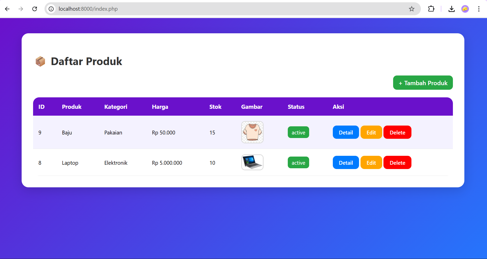

# 📦 Sistem CRUD Sederhana

[](https://www.php.net/) 
[](https://www.mysql.com/)

---

## 🌟 Deskripsi Aplikasi
Aplikasi ini merupakan **sistem CRUD (Create, Read, Update, Delete)** sederhana berbasis PHP & MySQL.  
Digunakan untuk mengelola data **[nama entitas, misal: Produk atau Mahasiswa]** secara mudah melalui antarmuka web.

**Entitas yang dipilih:**  
- **Produk**  
  - Atribut: `id`, `produk`, `kategori`, `harga`, `stok`, `gambar`, `status`, `aksi` 

**Fungsi Aplikasi:**  
- Menambah data baru  
- Menampilkan daftar data  
- Mengubah data yang sudah ada  
- Menghapus data tertentu  

---

## 🛠 Spesifikasi Teknis

- **PHP:** 8.x  
- **Database:** MySQL / MariaDB  
- **Struktur Folder:** 

    `public` 

         uploads
         index.php 
         delete.php
         detail.php
         edit.php
         index.php
         style.css

   `README.md` 

         readme.md
      
   `schema.sql`

       schema.sql

   `screenshots`

        create.png
        detail.png
        edit.png
        index.png
  
  `src` 

      database.php
      product.php
      productRepository.php
  
   `gitignore`

- **Penjelasan Class Utama**   
  ### Class Database
  Class `Database` bertugas untuk mengelola koneksi ke database MySQL menggunakan **PDO (PHP Data Objects)**, yang lebih aman dan fleksibel dibanding `mysqli`.

  **Properti:**
  - `$host` → alamat server database, misal `localhost`.
  - `$db` → nama database yang digunakan, misal `crud_produk`.
  - `$user` → username untuk login database, misal `root`.
  - `$pass` → password untuk login database, misal kosong (`""`) pada XAMPP.
  - `$conn` → properti untuk menyimpan objek koneksi PDO.

  **Method `connect()`:**
  - Mengecek apakah koneksi sudah dibuat (`$this->conn`).
  - Jika belum, membuat koneksi baru ke database menggunakan PDO:
  ```php
  new PDO(
      "mysql:host={$this->host};dbname={$this->db}",
      $this->user,
      $this->pass,
      [PDO::ATTR_ERRMODE => PDO::ERRMODE_EXCEPTION]
  );

- Mengatur mode error menjadi Exception agar setiap kesalahan koneksi bisa ditangkap.
- Mengembalikan objek koneksi PDO ($this->conn) agar bisa digunakan di class lain untuk operasi CRUD.

  ### Class Product

  Class `Product` merupakan **representasi entitas Produk** dalam sistem CRUD.  
  Class ini menyimpan semua atribut yang terkait dengan sebuah produk dan digunakan oleh repository untuk operasi database.

  **Properti:**
  - `$id` → ID unik produk (biasanya auto-increment di database).  
  - `$name` → Nama produk.  
  - `$category` → Kategori produk.  
  - `$price` → Harga produk.  
  - `$stock` → Jumlah stok produk tersedia.  
  - `$image_path` → Path file gambar produk.  
  - `$status` → Status produk (misal: "tersedia" atau "habis").

  **Constructor:**
    ```php
    public function __construct($name, $category, $price, $stock, $image_path, $status, $id = null)
    ```
    
  ### Class ProductRepository

    Class `ProductRepository` bertanggung jawab untuk **melakukan operasi CRUD** (Create, Read, Update, Delete) pada entitas `Product` di database menggunakan PDO.

   **Properti:**
  
   - `$pdo` → Menyimpan objek koneksi PDO dari class `Database`.

    **Constructor:**
    ```php
    public function __construct() {
    $this->pdo = (new Database())->connect();
    }
    ```

* Membuat koneksi ke database secara otomatis saat objek `ProductRepository` dibuat.
* Memanggil class `Database` dan method `connect()` untuk mendapatkan koneksi PDO.

---

  ### Method CRUD

1. **Create**

```php
public function create(Product $product)
```

* Menambahkan produk baru ke database.
* Menggunakan prepared statement untuk keamanan.
* Parameter: objek `Product`.
* Mengembalikan `true` jika berhasil, `false` jika gagal.

2. **Read All**

```php
public function getAll()
```

* Mengambil semua data produk dari tabel `products`.
* Mengembalikan array associative dari semua produk.

3. **Read by ID**

```php
public function getById($id)
```

* Mengambil data produk berdasarkan `id`.
* Mengembalikan array associative dari produk yang ditemukan.

4. **Update**

```php
public function update(Product $product)
```

* Mengubah data produk yang sudah ada di database.
* Parameter: objek `Product` yang sudah memiliki `id`.
* Mengembalikan `true` jika berhasil, `false` jika gagal.

5. **Delete**

```php
public function delete($id)
```

* Menghapus produk dari database berdasarkan `id`.
* Mengembalikan `true` jika berhasil, `false` jika gagal.

---

### Kegunaan

* Memisahkan logika database dari tampilan atau antarmuka.
* Memudahkan pengelolaan operasi CRUD pada entitas `Product`.
* Mendukung penggunaan **prepared statement**, sehingga lebih aman terhadap SQL Injection.

**Contoh Penggunaan:**

```php
$repo = new ProductRepository();

// Menambah produk baru
$product = new Product("Laptop", "Elektronik", 15000000, 10, "images/laptop.jpg", "tersedia");
$repo->create($product);

// Mengambil semua produk
$allProducts = $repo->getAll();

// Mengubah produk
$product->price = 14000000;
$repo->update($product);

// Menghapus produk
$repo->delete($product->id);
```

## 🚀 Instruksi Menjalankan Aplikasi

Ikuti langkah-langkah berikut agar aplikasi CRUD dapat berjalan.

---

### 1. Impor Basis Data
1. Buka **PHPMyAdmin** atau terminal MySQL.  
2. Impor file `sql/schema.sql` untuk membuat database dan tabel:
```sql
mysql -u root -p nama_database < sql/schema.sql
``` 

 **Catatan:**
* `nama_database` ganti sesuai nama database yang ingin digunakan
* Jika menggunakan PHPMyAdmin, pilih database → klik **Import** → pilih file `schema.sql`.

---

### 2. Atur Konfigurasi Koneksi Database

1. Buka file `config/config.php`.
2. Sesuaikan pengaturan koneksi dengan database Anda:

```php
<?php
define('DB_HOST', 'localhost');   // Host database
define('DB_USER', 'root');        // Username database
define('DB_PASS', '');            // Password database (kosong jika default XAMPP)
define('DB_NAME', 'crud_produk'); // Nama database
```


---

### 3. Jalankan Aplikasi

Gunakan built-in PHP server untuk menjalankan aplikasi:

```bash
php -S localhost:8000 -t public
```

* Opsi `-t public` menunjuk ke folder `public` sebagai root aplikasi.
* Server akan berjalan di `localhost:8000`.

---

### 4. Akses Aplikasi

Buka browser dan akses URL berikut:

```
http://localhost:8000/index.php
```

* Halaman utama menampilkan daftar produk.
* Dari sini Anda dapat menambahkan, mengubah, dan menghapus produk.

---

## 🧪 Contoh Skenario Uji Singkat

Berikut contoh langkah-langkah untuk menguji sistem CRUD:

---

### 1. Tambah 1 Data Baru
1. Buka halaman **Tambah Produk** (`index.php` → klik "Tambah Produk").  
2. Isi form dengan data produk baru:
   - Nama: `Laptop`
   - Kategori: `Elektronik`
   - Harga: `15000000`
   - Stok: `10`
   - Gambar: `images/laptop.jpg`
   - Status: `tersedia`  
3. Klik tombol **Simpan**.  
4. Produk baru akan tersimpan di database.

🎨 Tampilan Aplikasi


---

### 2. Tampilkan Daftar Data
1. Kembali ke halaman utama (`index.php`).  
2. Semua data produk termasuk yang baru ditambahkan akan muncul dalam tabel daftar produk. 

🎨 Tampilan Aplikasi


---

### 3. Ubah Data Tertentu
1. Pada tabel daftar produk, klik tombol **Edit** pada produk yang ingin diubah.  
2. Ubah informasi baju, misalnya:
   - Harga: `50000`
   - Stok: `15`  
3. Klik tombol **Simpan**.  
4. Perubahan akan disimpan di database dan ditampilkan di tabel produk.

🎨 Tampilan Aplikasi

`Tampilan edit data`

 

`Daftar produk setelah edit data`



---

### 4. Hapus Data
1. Pada tabel daftar produk, klik tombol **Hapus** pada produk yang ingin dihapus.  
2. Konfirmasi penghapusan.  
3. Produk akan dihapus dari database dan tabel akan diperbarui otomatis.
4.Kembali ke daftar produk, maka produk telah dihapus dari list 

🎨 Tampilan Aplikasi

`Konfirmasi Penghapusan`


`Penghapusan Berhasil`


`Daftar produk setelah proses delete`


---
 

